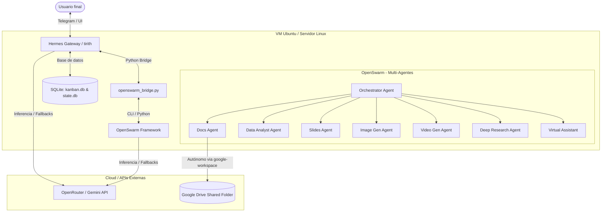

# Manual Técnico de Funcionamiento - Arquitectura Cybite

## 1. Introducción y Arquitectura del Sistema

La **Arquitectura Cybite** es un sistema híbrido y distribuido diseñado para optimizar el rendimiento y maximizar el uso de recursos de computación locales y en la nube. Está compuesto por tres entidades principales: **Hermes (Gateway de Entrada)**, **OpenSwarm (Core Multi-Agente)** y **Antigravity (Asistente de Desarrollo Autónomo)**.

El sistema opera distribuyendo las cargas de trabajo entre un **Host Windows (Entorno de Desarrollo)** y una **Máquina Virtual Ubuntu (Servidor Linux en Producción)** con recursos optimizados (4GB RAM).

### Diagrama Arquitectónico

---

## 2. Componentes del Sistema

### 2.1 Hermes (tirith) - Gateway y Gestión de Canales
*   **Función:** Actúa como el bot central de Telegram y la interfaz principal del sistema. Recibe solicitudes, gestiona hilos de conversación y canaliza tareas pesadas al backend.
*   **Persistencia:** Gestiona el estado conversacional, sesiones de usuario y tableros kanban.
*   **Ubicación:** `/home/administrador/.hermes`
*   **Ejecutable:** `bin/tirith` (Binario compilado).

### 2.2 OpenSwarm - Core de Agentes Especialistas
*   **Función:** Sistema de 8 agentes de IA autónomos que colaboran entre sí para generar entregables complejos (presentaciones, documentos, videos, análisis de datos).
*   **Ubicación:** `/home/administrador/.hermes/openswarm`
*   **Framework base:** [Agency Swarm](https://github.com/VRSEN/agency-swarm), adaptado para despliegue ligero en Linux.
*   **Ejecución:** Se ejecuta de forma asíncrona mediante el script `swarm.py` y se comunica con Hermes mediante `openswarm_bridge.py`.

### 2.3 Antigravity - Agente de Ingeniería de Sistemas (Yo)
*   **Función:** Asistente senior encargado del mantenimiento del código, corrección de errores críticos en producción y desarrollo, documentación técnica e implementación de respaldos.

---

## 3. Modelo de Persistencia y Base de Datos (SQLite)

El sistema utiliza dos bases de datos SQLite autónomas ubicadas en `/home/administrador/.hermes/`:

1.  **`kanban.db`**: Administra las tareas abiertas, en progreso y pendientes de la rutina diaria.
2.  **`state.db`**: Almacena el estado interno del gateway Hermes, logs de sesiones de Telegram, cachés de modelos y configuraciones del TUI.

### 3.1 Modo de Operación WAL (Write-Ahead Logging)
Ambas bases de datos funcionan con el modo `WAL` activo de SQLite. Esto permite:
*   Lecturas y escrituras simultáneas de forma ultra-rápida.
*   Mitigación de bloqueos de base de datos (`database is locked`).
*   Los archivos temporales `state.db-shm` y `state.db-wal` guardan las transacciones temporales en memoria o disco antes de fusionarse.

### 3.2 Proceso de Checkpoint y Respaldos Estructurados
Para asegurar la consistencia del respaldo, se implementó un flujo automático:
1.  **Fusión WAL:** Se realiza un checkpoint explícito (`PRAGMA wal_checkpoint(TRUNCATE);`) que escribe todas las transacciones WAL pendientes al archivo `.db` principal.
2.  **Respaldos Separados:**
    *   **Estructura (`_schema.sql`):** Solo la definición de tablas, índices y vistas.
    *   **Datos y Dump completo (`_dump.sql`):** Todo el contenido de la BD serializado a instrucciones SQL listas para ejecutar en un ambiente nuevo.
3.  **Ubicación de Respaldos:** `/home/administrador/.hermes/openswarm/database_backups/`

### 3.3 Mecanismo de Restauración Multiplataforma
Para el despliegue local o productivo, se utiliza el script de restauración en Python `restore_db.py`.
*   **Compatibilidad:** Funciona tanto en Linux como en Windows sin requerir el binario de consola `sqlite3` instalado, utilizando el módulo estándar de Python `sqlite3`.
*   **Operación:** Borra de manera segura archivos temporales corruptos (`-wal` y `-shm`) y recrea las bases de datos de forma limpia.

---

## 4. Integraciones y Servicios Externos

### 4.1 Inferencia y Respaldo Inteligente (OpenRouter)
El archivo `/home/administrador/.hermes/config.yaml` implementa un sistema inteligente de fallback de modelos para evitar bloqueos por falta de saldo o límites de API:
*   **Modelo Primario:** `gemini-2.0-flash` nativo (rápido y eficiente en costos).
*   **Pool de Fallbacks Gratuitos:** Cuando el primario falla, OpenRouter conmuta a modelos gratuitos:
    1.  `meta-llama/llama-3.3-70b-instruct:free`
    2.  `google/gemma-4-31b-it:free`
    3.  `qwen/qwen3-next-80b-a3b-instruct:free`
*   Esta configuración se comparte dinámicamente entre el TUI y el backend de agentes.

### 4.2 Búsqueda y Manejo de Google Drive (`google-workspace`)
La integración de Google Drive permite interactuar 100% en lenguaje natural gracias a un mapping autónomo:
*   **Script de Control:** `/home/administrador/.hermes/skills/productivity/google-workspace/scripts/google_api.py`
*   **Regla de Búsqueda:** Para realizar búsquedas con filtros en la API, se utiliza estrictamente la sintaxis `'ID_CARPETA' in parents and trashed = false`.
*   **Uso del flag `--raw-query`:** Es **obligatorio** en búsquedas lógicas avanzadas para evitar el error `HttpError 400`.
*   **Delegación a OpenSwarm:** La subida de entregables pesados a Google Drive se delega mediante el script puente al `Docs Agent`.

---

## 5. Configuración de Entornos (Windows vs Linux)

La Arquitectura Cybite está diseñada para coexistir de forma armónica entre ambientes:

*   **Linux (Ambiente Productivo):**
    *   La base de datos se almacena en `/home/administrador/.hermes/`.
    *   Los agentes corren sobre el entorno virtual Python `openswarm_venv`.
    *   Los servicios se administran de forma persistente (a través de systemd).
    *   El `.gitignore` del proyecto excluye archivos de entorno locales (`.env`), cachés y archivos de logs pesados.
*   **Windows (Ambiente Local Desarrollador):**
    *   Utiliza el script `restore_db.py` para levantar de forma local el esquema idéntico de base de datos.
    *   Los scripts y variables de entorno `.env` deben ser configurados de forma local respetando las variables de configuración nativas sin subir credenciales al repositorio GitHub público.
